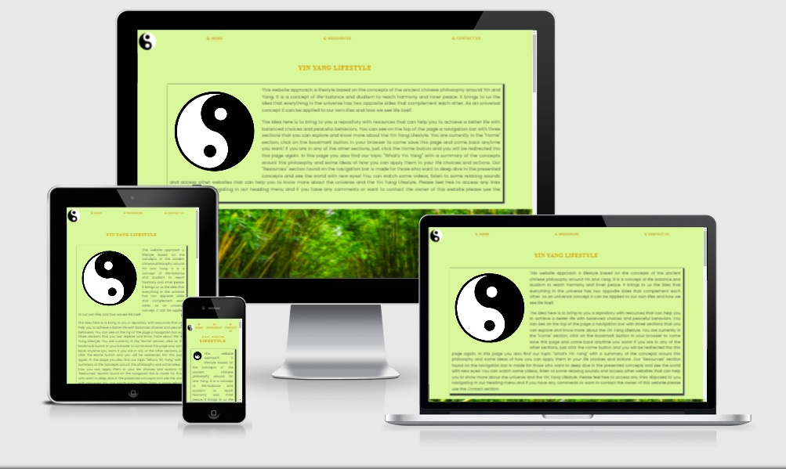

# Yin-Yang Website

## Welcome fellow visitor,

This website was crafted using only semantic HTML5 and CSS3. It was created to give birth to the first "Portfolio Project" that I have had to complete as part of the Diploma in Full Stack Software Development course at Code Institute in Dublin, Republic of Ireland. 

The Yin Yang Lifestyle Website brings the ancient principles of Yin and Yang to the modern life and provide the user with resources that can make his life more balanced, healthy and peaceful. The user interested on this idea can start on the home page with the presentation text explaining the purpose of the website and information about it. Users that wish to have a deeper understanding about the subject can check the resources page that is filled with videos and audios to watch and listen on meditating or relaxing momments. It´s also possible to find links that lead to different websites with valued materials related to the idea presented. At last, there´s a Contact page with the specifications about the website and information of contact with the creator.

## How to get into this journey 

For better UI/UX we used a modern and simple interface with a well defined navigation bar, spaced letters with a good contrast for a cool reading and colors based on a bamboo pallette uniformized in the entire website.

The layout has a intuitive structure with the navigation bar at the top, footer at the bottom and the content on the area in between. The styling is consistent through all pages. Links are styled to be underlined when selected and when hovered upon, also the external links open in a new tab. The main navigation links also have a distinct color to catch the user's attention and to encourage to click them.

The footer contains icons for Facebook, Instagram, Github and LinkedIn, which link as expected to my accounts on the respective platforms. The website is fully responsive and can be accessed on many different screens and compatiple with the most used browsers.

At the Home page, the main area contains a spinning YinYang made with pure CSS took from CodePen.io with credits to @AdamSSenniN who create it.

### Wireframes

This website was first planned from scratch on Balsamic Wireframes with the licence provided by the Code Institute. The wireframes of the raw project can be seen below.

### Images

- The three images on the index page were taken from [Pexels](https://www.pexels.com/)
- [Bamboo path](https://www.pexels.com/photo/boardwalk-between-trees-4925235/)
- [Balanced rocks](https://www.pexels.com/photo/balance-macro-ocean-pebbles-235990/)
- [Budda and sage incense](https://www.pexels.com/photo/stone-buddha-and-sage-incense-bundle-in-bowl-on-marble-shelf-4203071/)

- The illustration from the "lost.html" page was taken from [error404.fun](https://error404.fun/)

### Validator Testing 

- HTML
  - No errors were returned when passing through the official [W3C validator](#)
- CSS
  - No errors were found when passing through the official [(Jigsaw) validator](#)

### Content 

- The text for the Home page was created by myself, except where it´s quoted, which has its oun reference 
- The icons in the footer were taken from [Font Awesome](https://fontawesome.com/)

Enjoy it!