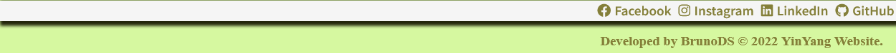
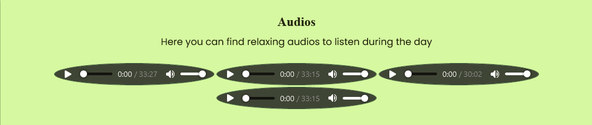
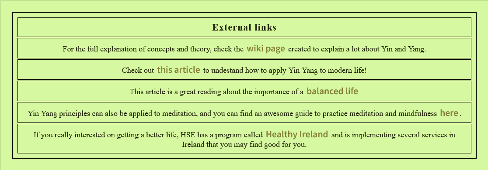

# Yin-Yang Website

[Access the Live YinYang Website here](https://bruno-diego.github.io/CodeInstitutePortfolio1/)

## Table of Contents
1. [**UX**](#ux)
    - [**Purpose of the project**](#purpose-of-the-project)
    - [**User stories**](#user-stories)
    - [**Features**](#features)
    - [**Future Features**](#future-features)

2. [**Typography and color scheme**](#typography-and-color-scheme)

3. [**Wireframes**](#wireframes)

4. [**Technologies Used**](#technologies-used)
    - [**Code validation**](#code-validation)
    - [**Test cases (user story based with screenshots)**](#test-cases)
    - [**Fixed bugs**](#fixed-bugs)
    - [**Supported screens and browsers**](#supported-screens-and-browsers)

5. [**Deployment**](#deployment)
    - [**Via Gitpod**](#via-gitpod)
    - [**Via Github Pages**](#via-github-pages)
6. [**Credits**](#credits)

---

## UX

## Purpose of the project

Welcome fellow visitor,

The Yin Yang Lifestyle Website with the purpose of bring the ancient principles of Yin and Yang to the modern life and provide the user with resources that can make his life more balanced, healthy and peaceful. 

This website is made up of the following sections:

  1. Home/Introduction.
  2. Resources with Videos, Audios and Useful Links.
  3. Contact with information about the creation and a form to sign up to the newsletter.

The business goals for this website are:

  1. To inform the user about the principles behind the yin-yang doctrine.
  2. To inspire the user to have a balanced and mindful life based on the yin-yang principles.
  3. Provide the users with content that can change their lifestyle.

The target users are:

  - People of any ages.
  - Interested in having a balanced, peaceful and healty lifestyle.
  - Interested in know more about new lifestyles.

What these users would be looking for:

  - Clear, concise, easy-to-find information.
  - Calming videos and audios watch/listen while doing daily tasks.
  - Helpful guidance to have a balanced lifestyle.

The user interested on the presented ideas can start on the home page with the presentation text explaining the purpose of the website and information about it. Users that wish to have a deeper understanding about the subject can check the resources page that is filled with videos and audios to watch and listen on meditating or relaxing momments. It´s also possible to find links that lead to different websites with valued materials related to the idea presented. At last, there´s a Contact page with the specifications about the website and information of contact with the creator.

The following features will be included in this release:

  - Header and menu bar, to navigate to various sections of the page.
  - Resources page with calming videos, sounds and links for external websites.
  - Information and recommendations for having a balanced lifestyle.
  - Newsletter sign up form.
  - Links to social media pages.

This website was crafted using only semantic HTML5 and CSS3. It was created to give birth to the first "Portfolio Project" to complete as part of the Diploma in Full Stack Software Development course at Code Institute in Dublin, Republic of Ireland. 

For better UI/UX, a modern and simple interface is used with a well defined navigation bar, spaced letters with a good contrast for a cool reading and colors based on a bamboo pallette uniformized in the entire website.

The layout has a intuitive structure with the navigation bar at the top, footer at the bottom and the content on the area in between. The styling is consistent through all pages. Links are styled to be underlined when selected and when hovered upon, also the external links open in a new tab. The main navigation links also have a distinct color to catch the user's attention and to encourage to click them.

The footer contains icons for Facebook, Instagram, Github and LinkedIn, which link as expected to the creators accounts on the respective platforms. The website is fully responsive and can be accessed on many different screens and compatiple with the most used browsers.

## User stories

  - As a **visitor**, I can intuitively navigate through the site so that I can view desired content.
  - As a **visitor**, I can easily find useful information & tips for a better balanced life and inspiration to use the website's content.
  - As a **visitor** I can find a navigation bar and footer so that I can see what content there is on the website.
  - As a **visitor** I can get key information about the website so that I can spend less time having to search for information.
  - As a **visitor** I can find calming videos to watch on momments of relaxing.
  - As a **visitor** I can find calming sounds to listen while doing daily tasks.
  - As a **visitor** I can access useful resources to deep dive the website's subject.
  - As a **visitor** I can contact the creator via e-mail with the contact form.
  - As a **visitor** I am notified about success/fail submission of the e-mail message.
  - As a **visitor** I can access the website on both mobile and desktop so that I can view the information regardless of my location.

## Features

### Navigation Bar

  - Featured on all four pages, the full responsive navigation bar includes links to the Home page, Resources and Contact page and is identical in each page to allow for easy navigation.
  - This section will allow the user to easily navigate from page to page across all devices without having to revert back to the previous page via the ‘back’ button.

  

### The Landing Page Section

  - The Landing Page includes a CSS-only spinning Yin-Yang and a presentation text introducing the user to the Yin Yang Lifestyle project and an image of a bamboo forrest to bring the unconsious idea of nature to the user experience.
  - The credits for the spinning Yin-Yang animation goes to @AdamSSenniN and can be viewed in [this link](https://codepen.io/AdamSSenniN/pen/xZpaow).

  

### Cards Section
  
  - The cards section will allow the user to see the benefits of joining the YinYang Lifestyle, as well as understanding more about a balanced life overall.

  - The user will see the value of adopting this idea and should encourage the user to consider to have abalanced life.

  - At the bottom of the section an advertisement was created to inform the users that this project is not a religion or any form of councelling.

### The Footer

  - The footer section includes links to the relevant social media sites for Love Running. The links will open to a new tab to allow easy navigation for the user. 
  - The footer is valuable to the user as it encourages them to keep connected via social media.

### Videos

  - The videos in resources page will provide the user with calming and relaxing videos from YouTube's Creative Commons.

  

### Audios

  - These audios were extracted from YouTube's Creative Commons so the user can listen while doing other tasks.

   

### Links

  - The user who wants to learn more and seek other resources has a list of links avalable to search more ways to have a balanced life.

  

### The Ending Text

  - At the contact page the user can find a closure text with information about the creator, the purpose of the website and techinical especifications.

  - This text provides the user with an e-mail to contact the creator.

  

### The Contact Form

- The user who wants to contact the creator can send a message to the e-mail provided or fill the form at the bottom of the contact page.
- This contact form was created with didactical purposes with the objective to allow the user to get in touch with the content creator submiting his name and e-mail.
- This is a fully functional feature thanks to the [FormSubmit website](https://formsubmit.co/) that alows the page to send the user's message to the creator e-mail only using HTML.

### The Success Page

  - The button of the contact form leads the user to the success page confirming that the e-mail with the message was successfully sent.
  - The credits for the animation goes to the work done in Codepen.io by Konstantin Rouda
 (@Konrud) and can be viewed on [this link](https://codepen.io/Konrud/pen/mwZXgV).
 
 __Image to be UPDATED__
  

## Typography and color scheme

- The colors on the website is inspired on a Bamboo Palette created on [Coolors.co](https://coolors.co/) with multiple shades of greens to inspire a nature and peaceful vibe on the user.

## Wireframes

This website was first planned from scratch on Balsamic Wireframes with the licence provided by the Code Institute. [Click here](./docs/wireframes.pdf) to see the wireframes of the raw project.

Please note the actual website has changed slightly from these wireframes.

## Tecnologies

I have used several technologies that have enabled this design to work:

- [HTML](https://developer.mozilla.org/en-US/docs/Web/HTML)
    - Used as the basic building block for the project and to structure the content.
- [CSS](https://developer.mozilla.org/en-US/docs/Learn/Getting_started_with_the_web/CSS_basics)
    - Used to style all the web content across the project. 
- [Font Awesome](https://fontawesome.com/)
    - Used to obtain the social media icons used in the footer and the icons in La Petite Review.
- [Google Developer Tools](https://developers.google.com/web/tools/chrome-devtools)
    - Used as a primary method of fixing spacing issues, finding bugs, and testing responsiveness across the project.
- [GitHub](https://github.com/)
    - Used to store code for the project after being pushed.
- [Git](https://git-scm.com/)
    - Used for version control by utilising the Gitpod terminal to commit to Git and Push to GitHub.
- [Gitpod](https://www.gitpod.io/)
    - Used as the development environment.
- [Balsamiq](https://balsamiq.com/)
    - Used to create the wireframes for the project
- [Coloors](https://coolors.co/)
    - Used to create a colour palette for the design.
- [Favicon.io](https://favicon.io/)
    - Used to create favicon's for my website.
- [Color Contrast Accessibility Validator](https://color.a11y.com/)
    - Allowed me to test the colour contrast of my webpage.
- [W3C Markup Validation Service](https://validator.w3.org/) 
    - Used to validate all HTML code written and used in this webpage.
- [W3C CSS Validation Service](https://jigsaw.w3.org/css-validator/#validate_by_input)
    - Used to validate all CSS code written and used in this webpage.
- [FormSubmit](https://formsubmit.co/)
    - Used to submit a contact message with the HTML form.
- [AmIResponsive](http://ami.responsivedesign.is/)
    - Used to generate repsonsive image used in README file.

## Deployment

The master branch of this repository has been used for the deployed version of this application.

## Via Gitpod

The project deployment was based on the [Code Institute Gitpod Full Template](https://github.com/Code-Institute-Org/gitpod-full-template).

  - Click the `Use This Template` button.
  - Add a repository name and brief description.
  - Click the `Create Repository from Template` to create your repository.
  - To create a Gitpod workspace you then need to click `Gitpod`, this can take a few minutes.
  - When you want to work on the project it is best to open the workspace from Gitpod (rather than Github) as this will open your previous workspace rather than create a new one. You should pin the workspace so that it isn't deleted.
  -  Committing your work should be done often and should have clear/explanatory messages, use the following commands to make your commits:
    - `git add .`: adds all modified files to a staging area
    - `git commit -m "A message explaining your commit"`: commits all changes to a local repository.
    - `git push`: pushes all your committed changes to your Github repository.

*Forking the GitHub Repository*

If you want to make changes to your repository without affecting it, you can make a copy of it by 'Forking' it. This ensures your original repository remains unchanged.

  1. Find the relevant GitHub repository
  2. In the top right corner of the page, click the Fork button (under your account)
  3. Your repository has now been 'Forked' and you have a copy to work on

*Cloning the GitHub Repository*

Cloning your repository will allow you to download a local version of the repository to be worked on. Cloning can also be a great way to backup your work.

  1. Find the relevant GitHub repository
  2. Press the arrow on the Code button
  3. Copy the link that is shown in the drop-down
  4. Now open Gitpod & select the directory location where you would like the clone created
  5. In the terminal type 'git clone' & then paste the link you copied in GitHub
  6. Press enter and your local clone will be created.

## Via Github Pages

  - The live website was deployed to GitHub pages. The steps to deploy are as follows: 
  
    1. Log in to GitHub
    2. In your Repository section, select the project repository that you want to deploy
    3. In the menu located at the top of this section, click `Settings`
    4. Select `Pages` on the left-hand menu - this is around halfway down
    5. In the source section, select branch `Master` and save
    6. The page is then given a site URL which you will see above the source section, it will look like the following: 

  

Please note it can take a while for this link to become fully active. 

The live link can be found [here](https://bruno-diego.github.io/CodeInstitutePortfolio1/).

## Images

- The three images on the index page were taken from [Pexels](https://www.pexels.com/).
- [Bamboo path](https://www.pexels.com/photo/boardwalk-between-trees-4925235/).
- [Balanced rocks](https://www.pexels.com/photo/balance-macro-ocean-pebbles-235990/).
- [Budda and sage incense](https://www.pexels.com/photo/stone-buddha-and-sage-incense-bundle-in-bowl-on-marble-shelf-4203071/).

- The illustration from the "lost.html" page was taken from [error404.fun](https://error404.fun/).

## Validator Testing 

- HTML
  - No errors were returned when passing through the official [W3C validator](#).
- CSS
  - No errors were found when passing through the official [(Jigsaw) validator](#).

## Content 

- The text for the Home page was created by myself, except where it´s quoted, which has its own reference .
- The icons in the footer were taken from [Font Awesome](https://fontawesome.com/).

---

## Acknowledgements

I would like to thank my course mentor Rohit Sharma for his support and guidance throughout the course of the project.

---