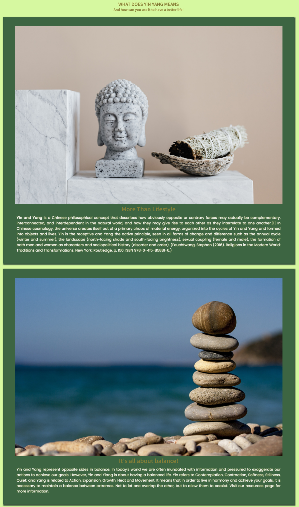
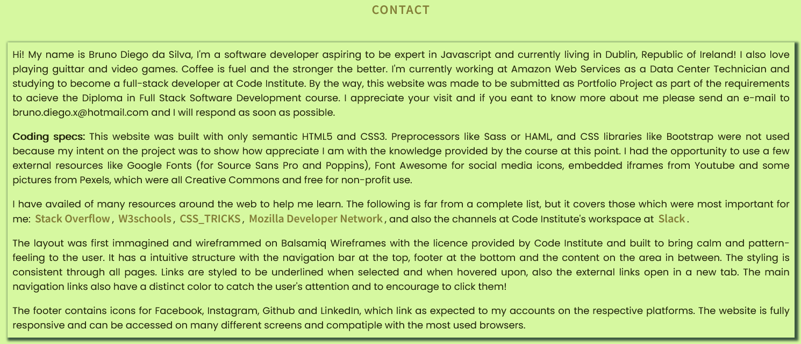

# Yin-Yang Website

[Access the Live YinYang Website here](https://bruno-diego.github.io/CodeInstitutePortfolio1/)

## Welcome fellow visitor,

The Yin Yang Lifestyle Website brings the ancient principles of Yin and Yang to the modern life and provide the user with resources that can make his life more balanced, healthy and peaceful. The user interested on this idea can start on the home page with the presentation text explaining the purpose of the website and information about it. Users that wish to have a deeper understanding about the subject can check the resources page that is filled with videos and audios to watch and listen on meditating or relaxing momments. It´s also possible to find links that lead to different websites with valued materials related to the idea presented. At last, there´s a Contact page with the specifications about the website and information of contact with the creator.

This website was crafted using only semantic HTML5 and CSS3. It was created to give birth to the first "Portfolio Project" that I have had to complete as part of the Diploma in Full Stack Software Development course at Code Institute in Dublin, Republic of Ireland. 

## How to get into this journey 

For better UI/UX we used a modern and simple interface with a well defined navigation bar, spaced letters with a good contrast for a cool reading and colors based on a bamboo pallette uniformized in the entire website.

The layout has a intuitive structure with the navigation bar at the top, footer at the bottom and the content on the area in between. The styling is consistent through all pages. Links are styled to be underlined when selected and when hovered upon, also the external links open in a new tab. The main navigation links also have a distinct color to catch the user's attention and to encourage to click them.

The footer contains icons for Facebook, Instagram, Github and LinkedIn, which link as expected to my accounts on the respective platforms. The website is fully responsive and can be accessed on many different screens and compatiple with the most used browsers.

At the Home page, the main area contains a spinning YinYang made with pure CSS took from CodePen.io with credits to @AdamSSenniN who create it.

## Wireframes

This website was first planned from scratch on Balsamic Wireframes with the licence provided by the Code Institute. [Click here](./docs/wireframes.pdf) to see the wireframes of the raw project.

## Features

### Navigation Bar

  - Featured on all four pages, the full responsive navigation bar includes links to the Home page, Resources and Contact page and is identical in each page to allow for easy navigation.
  - This section will allow the user to easily navigate from page to page across all devices without having to revert back to the previous page via the ‘back’ button.

  

### The Landing Page Section

  - The Landing Page includes a CSS-only spinning Yin-Yang and a presentation text introducing the user to the Yin Yang Lifestyle project and an image of a bamboo forrest to bring the unconsious idea of nature to the user experience.

  

### Cards Section
  
  - The cards section will allow the user to see the benefits of joining the YinYang Lifestyle, as well as understanding more about a balanced life overall.

  - The user will see the value of adopting this idea and should encourage the user to consider to have abalanced life.

  - At the bottom of the section an advertisement was created to inform the users that this project is not a religion or any form of councelling.

### The Footer

  - The footer section includes links to the relevant social media sites for Love Running. The links will open to a new tab to allow easy navigation for the user. 
  - The footer is valuable to the user as it encourages them to keep connected via social media.

### Videos

  - The videos in resources page will provide the user with calming and relaxing videos from YouTube's Creative Commons.

  

### Audios

  - These audios were extracted from YouTube's Creative Commons so the user can listen while doing other tasks.

   

### Links

  - The user who wants to learn more and seek other resources has a list of links avalable to search more ways to have a balanced life.

  

### The Ending Text

  - At the contact page the user can find a closure text with information about the creator, the purpose of the website and techinical especifications.

  - This text provides the user with an e-mail to contact the creator.

  

### The Contact Form

- The user who wants to contact the creator can send a message to the e-mail provided on the closing text.
- This contact form was created with didactical purposes with the objective to allow the user to get in touch with the content creator submiting his name and e-mail.
- This is a feature to be implemented, at the moment the send message button is a link that only leads to a 404 (lost) page.

### The Lost Page

  - Since this is a static website, The link to contact leads to a lost page with an image and a message saying the feature is still not available.

  

## Deployment

- The site was deployed to GitHub pages. The steps to deploy are as follows: 
  - In the GitHub repository, navigate to the Settings tab 
  - From the source section drop-down menu, select the Master Branch
  - Once the master branch has been selected, the page will be automatically refreshed with a detailed ribbon display to indicate the successful deployment. 

The live link can be found here - https://bruno-diego.github.io/CodeInstitutePortfolio1/

## Images

- The three images on the index page were taken from [Pexels](https://www.pexels.com/).
- [Bamboo path](https://www.pexels.com/photo/boardwalk-between-trees-4925235/).
- [Balanced rocks](https://www.pexels.com/photo/balance-macro-ocean-pebbles-235990/).
- [Budda and sage incense](https://www.pexels.com/photo/stone-buddha-and-sage-incense-bundle-in-bowl-on-marble-shelf-4203071/).

- The illustration from the "lost.html" page was taken from [error404.fun](https://error404.fun/).

## Validator Testing 

- HTML
  - No errors were returned when passing through the official [W3C validator](#).
- CSS
  - No errors were found when passing through the official [(Jigsaw) validator](#).

## Content 

- The text for the Home page was created by myself, except where it´s quoted, which has its own reference .
- The icons in the footer were taken from [Font Awesome](https://fontawesome.com/).

Enjoy it!
